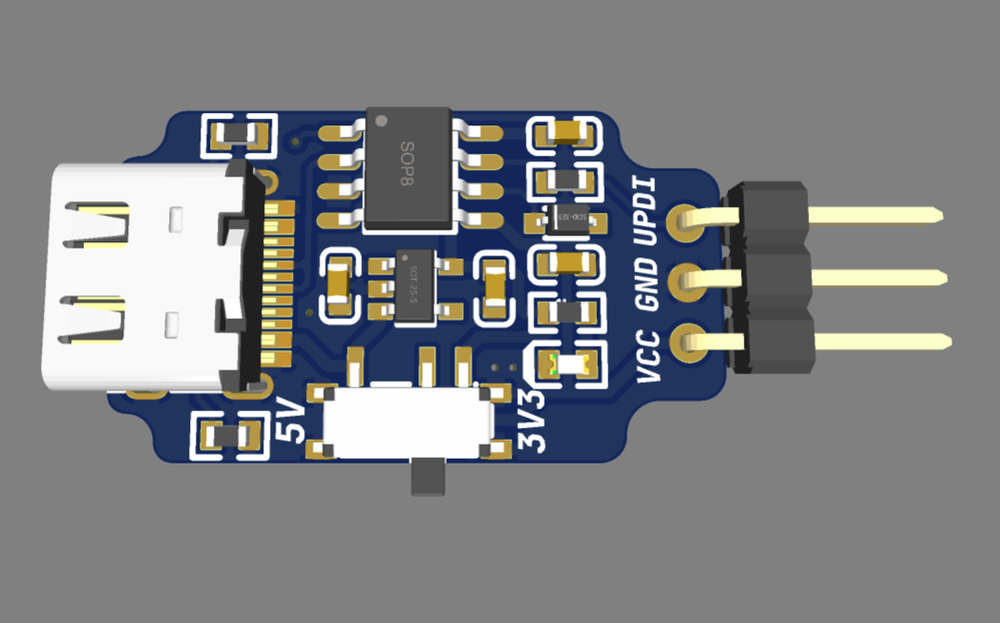
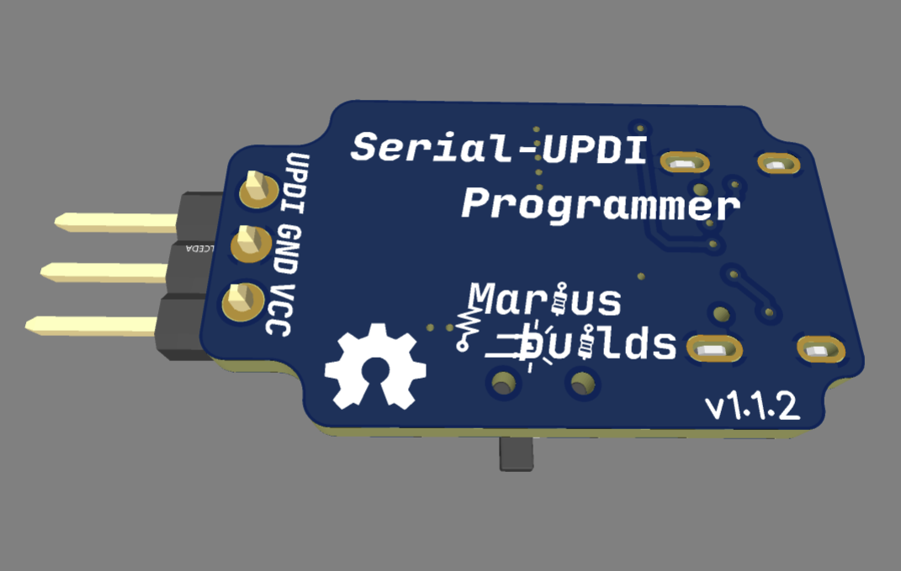

# Serial-UPDI Programmer (USB-C)

A tiny UPDI programmer for **tinyAVR, megaAVR and AVR-Dx** microcontrollers, now with **USB-C** and a few rounded corners for style points. Because programming a 50-cent microcontroller should not necessarily require hunting for a USB-A port.



This is a remix of the excellent **[CH340N SerialUPDI Programmer](https://oshwlab.com/wagiminator/pyupdi-programmer_copy_copy)** by [wagiminator](https://github.com/wagiminator) (original repo: [AVR-Programmer](https://github.com/wagiminator/AVR-Programmer)). All the clever engineering is his. I just gave it a modern connector and a haircut.

## What's new in this version 🆕

- **USB-C instead of USB-A** – more future proof, reversible, and it fits whatever cable is already on your desk. Proper **5.1kΩ CC resistors** included, so it also works with C-to-C cables.
- **Rounded PCB outline** – it does exactly the same thing as before, but now it looks good doing it.
- **Through-hole voltage switch** (MSK12C02) – sturdier and a lot easier to solder.
- **Right-angle header** – plug it in flat, so the programmer lies nicely on the desk instead of standing up like a periscope.

## MAIN FEATURES :

- **CH340N USB-to-serial** – a tiny SOP-8 chip that does all the heavy lifting.
- **5V / 3.3V selection switch** – power the target at whichever voltage it likes, courtesy of an AP2112K 3.3V LDO.
- **Diode-based SerialUPDI** – the standard "SerialUPDI with diode" circuit, supported by Arduino IDE and pymcuprog.
- **Power LED** – so you know it's alive.
- **3-pin header: VCC, GND, UPDI** – three wires, that's the whole interface. UPDI is wonderfully minimalist.



## IMPORTANT INFORMATIONS ! 

1. **Install the CH340 driver first.** Windows and macOS don't always include it, and without it your computer will politely pretend nothing is plugged in. Official drivers: https://www.wch-ic.com/downloads/CH341SER_EXE.html (Windows) / https://www.wch-ic.com/downloads/CH34XSER_MAC_ZIP.html (macOS).

2. **Set the voltage switch BEFORE connecting the target.** Feeding 5V into a 3.3V-only circuit is a very quick way to turn a microcontroller into a very small keychain.

3. **The VCC pin powers the target.** If your target board already has its own power supply, connect only **GND and UPDI**, unless you enjoy two power supplies arguing with each other.

## How to use it 

### Arduino IDE

1. Install [megaTinyCore](https://github.com/SpenceKonde/megaTinyCore) (tinyAVR) or [DxCore](https://github.com/SpenceKonde/DxCore) (AVR-Dx) by SpenceKonde.
2. Select your chip under **Tools → Board**.
3. Under **Tools → Programmer** choose one of the **SerialUPDI** options (230400 baud is a good starting point, use a slower one if you get errors).
4. Select the COM port and use **Upload Using Programmer** (Ctrl+Shift+U).

### pymcuprog (command line)

[pymcuprog](https://github.com/microchip-pic-avr-tools/pymcuprog) is the official successor of pyupdi:

```bash
pip install pymcuprog
pymcuprog write -t uart -u COM5 -d attiny1614 -f firmware.hex --erase --verify
```

Replace `COM5` with your port (`/dev/ttyUSB0` on Linux) and `attiny1614` with your chip. If it says "Verify OK", congratulations: you are now officially an AVR whisperer.

## Main components 

| Part | Component | LCSC |
|---|---|---|
| USB-to-serial | CH340N | C506813 |
| LDO 3.3V | AP2112K-3.3TRG1 | C51118 |
| USB-C connector | GT-USB-7010ASV | C2988369 |
| Voltage switch | MSK12C02 | C431540 |
| UPDI diode | 1N4148WS | C2128 |
| Power LED | Everlight 19-217/GHC | C72043 |
| UPDI header | 3P 2.54mm right-angle | C7501291 |

Full BOM in the **GERBER, BOM, PNP** folder.


## If you want to edit the PCB

**Project can also be found here:** https://oshwlab.com/mariusmym/usb-c_ch340n_updi_programmer

## Credits 

Original design by **[wagiminator](https://github.com/wagiminator)**: https://github.com/wagiminator/AVR-Programmer. Go give his repo a star, he has a lot of other cool stuff there too.

## License 

[](https://creativecommons.org/licenses/by-sa/4.0/)

The original design is licensed under CC BY-SA 3.0, so this remix is shared under [Creative Commons Attribution-ShareAlike 4.0 International](https://creativecommons.org/licenses/by-sa/4.0/).

- ✅ **Share** – copy and redistribute it in any medium or format
- ✅ **Adapt** – remix, transform, and build upon it, even commercially
- 🏷️ **Attribution** – give credit to wagiminator and to this remix
- 🔁 **ShareAlike** – if you remix it, share your version under the same license

## Donate ☕

If you'd like to say thanks or buy me a coffee, a **[PayPal donation](https://www.paypal.com/donate/?hosted_button_id=KHR7DYJP2Z8QJ)** is always appreciated!

Have fun and enjoy it ! 😊
